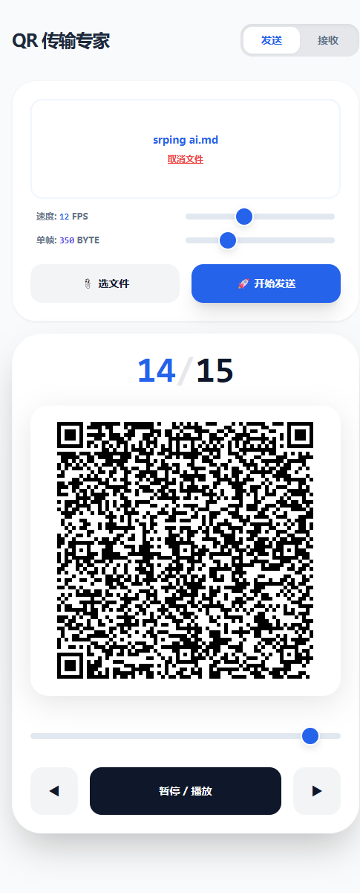
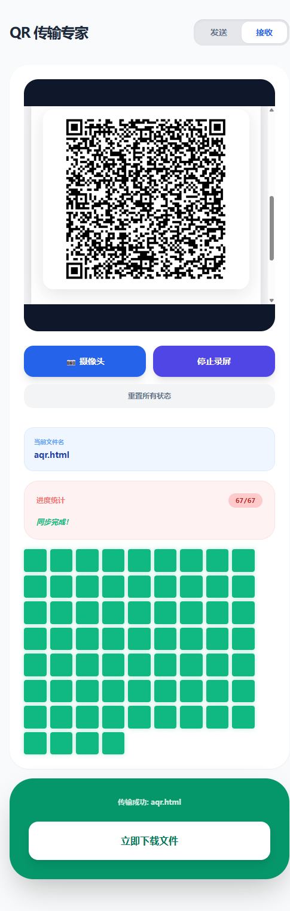

# AirScan-QR 📡

**AirScan-QR** 是一款专为**物理隔离环境 (Air-gapped)** 及 **跨端受限网络** 设计的高效文件传输方案。它通过动态二维码序列流，利用“屏幕+摄像头”的视觉链路，彻底打破物理与协议的边界。

## 🌟 核心场景

在无法连接互联网、禁用 U 盘、或无法建立局域网共享的场景下，AirScan-QR 是你的最佳选择：

* **封闭开发/实验室环境**：从物理隔离的内网 PC 中取出日志、代码片段或小文件。
* **跨设备“无协议”互传**：手机与手机之间、Android 与 iOS 之间，无需蓝牙或 WiFi，开码即传。
* **远程桌面/VPN 穿透**：直接通过摄像头扫描远程桌面窗口中的二维码，将文件从远程服务器“拿”回本地 PC。
* **无痕传输**：无需安装驱动，无需注册账号，所有逻辑在浏览器本地执行，不留物理痕迹。

## 🚀 快速上手

### 方案 A：手机 ↔ 手机（移动互传）

1. 两台设备均访问：[https://topcss.github.io/AirScan-QR/](https://topcss.github.io/AirScan-QR/)
2. **发送方**：点击“选择文件” -> 设置帧率 -> 开始广播。
3. **接收方**：点击“开始扫描” -> 对准发送方屏幕 -> 完成后自动触发下载。

### 方案 B：PC → 手机（内网提取）

1. 内网 PC 打开本项目（可通过 HTML 离线文件）。
2. 发送方选择文件并广播。
3. 手机扫码接收，实现文件“出网”。

### 方案 C：远程 PC → 本机 PC（穿透 VPN/远程桌面）

1. 在远程窗口中运行发送端并显示二维码。
2. 本机 PC 接收中，选择屏幕录制，选择对应的应用窗口，即可接收文件。

## 📸 界面预览 (UI Preview)

| 发送端界面 (Sender) | 接收端界面 (Receiver) |
| :---: | :---: |
|  |  |
| **功能**：文件切片、动态帧率调节、实时广播 | **功能**：扫码识别、分片重组、自动下载 |

## ✨ 功能亮点

* ⚡ **高速流传输**：基于 `qrious` 优化算法，支持 1-30 FPS 动态帧率调节。
* 🧩 **动态分片技术**：单帧容量支持 200-800 Byte 自由调节，适配不同性能的扫描端。
* 🔄 **智能补帧机制**：可视化缺失帧矩阵，点击特定帧即可单点重传，攻克环境光干扰导致的跳帧难题。
* 📄 **元数据保留**：支持超长文件名及后缀名的无损还原，确保文件开箱即用。
* 🎨 **极简交互**：基于 Tailwind CSS 构建，适配手机与 PC 端，支持深色模式。

## 🛠️ 技术原理

项目采用**二维码流水线协议 (QR-Pipeline Protocol)**：
`TaskID | FileName | TotalFrames | CurrentIndex | DataPayload`

* **数据编码**：将文件转化为 Base64 后进行切片分段。
* **索引校验**：通过数组索引重组分片，确保文件合并顺序 100% 准确。
* **零服务器依赖**：纯客户端逻辑，数据不经过中转，隐私安全无忧。

## 📦 部署与使用

由于采用单 HTML 架构，你可以根据需求选择：

1. **在线访问**：通过 GitHub Pages 直接使用。
2. **本地携带**：右键“另存为” `index-embedded.html`，嵌入式单文件版本，放入 U 盘随身携带。
3. **内网分发**：直接将 HTML 文件部署在内网静态服务器或共享文件夹中。

## 📜 许可证

MIT License © [Jack/topcss]

## 待解决事项

- airscan-fountain.html 实现了喷泉码，四码同传，效率极高，但是简单的文本会导致卡死，哪位朋友有空可以看看。
